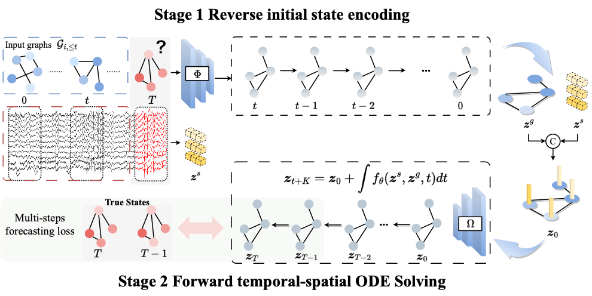
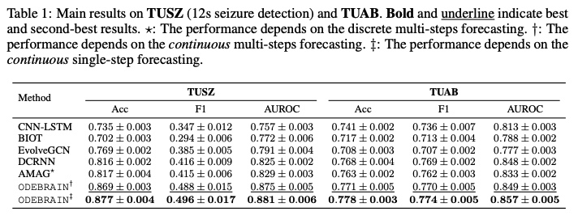

# ODEBRAIN
Continuous-Time EEG Graph for Modeling Dynamic Brain Networks

*Figure: Continuous neural dynamics modeling via ODEBRAIN with graph forecasting. In stage 1, multi-channel EEG signals are encoded into spectral graph snapshots and fused with raw signal features to construct noise-robust initial states for ODE integration to predict the future spectral graphs. In stage 2, ODEBRAIN propagates latent states through time, generating dynamic field $f$ that capture continuous trajectory. Lastly, future graph node embeddings are obtained by $z_{T}$, and measure with ground truth graph node.

## Abstract
**NeuroTSo** is a neural ODE-based forecasting framework for modeling neural populaion dynamics. It integrates spectral-temporal-spatial EEG features into graph-structured representations and leverages continuous-time latent dynamics modeling for brain state estimation.
The framework is designed to address:
    - Arbitrary-time brain state forecasting via continuous temporal-spatial solvers
    - Structured spatial and stochastical EEG temporal dynamics learning
    - Flexible modeling via continuous temporal-spatial solvers

## Project Structure
    ├── data/                   # Preprocessing scripts
    ├── models/                 # Model architectures (ODE solver, encoder, etc.)
    ├── fig/                    # Figures used in documentation
    ├── main.py                 # Training and evaluation entry
    ├── args.py                 # Configurable parameters
    └── README.md

## Dataset
We use **Temple University Seizure Corpus (TUSZ)** v1.5.2 dataset, publicly available at: [here](https://isip.piconepress.com/projects/tuh_eeg/).
Once your request form is accepted, you can access the dataset.

---

## Setup

Install dependencies:

```bash
pip install -r requirements.txt
```

---

## Preprocessing
All EEG signals are resampled to 200 Hz and saved in h5 format (19 channels).

Run the following command:

```bash
python ./data/resample_signals.py --raw_edf_dir <tusz-data-dir> --save_dir <resampled-dir>
```
where `<tusz-data-dir>`: Path to original TUSZ EDF data.
 `<resampled-dir>`: Directory to save the resampled signals.
 
## Experiments
### Configurations
You can modify settings and training parameters by editing the 'args.py' file. 
This includes adjusting the task, model, number of epochs, learning rate, batch size, and other model training parameters. 
Alternatively, you can specify them during execution using flags like '--num_epochs'.

### Training and Evaluation
Training example:
```bash
python main.py --dataset TUSZ --input_dir <resampled-dir> --raw_data_dir <tusz-data-dir> --save_dir <save-dir> --task detection --model_name evobrain --num_epochs 100 
```
Results (metrics, logs) will be saved to `<save-dir>`.

Evaluation example:
```bash
python main.py --dataset TUSZ --input_dir <resampled-dir> --raw_data_dir <tusz-data-dir> --save_dir <save-dir> --task detection --test --load_model_path <save-model-dir> --model_name evobrain
```

### Supported Baselines
The following baseline models are supported:
| Model       | Description                       |
| ----------- | --------------------------------- |
| `BIOT`      | Transformer-based biosignal model |
| `evolvegcn` | Dynamic graph convolution network |
| `dcrnn`     | Diffusion Convolutional RNN       |
| `lstm`      | Standard LSTM model               |
| `cnnlstm`   | CNN-enhanced LSTM                 |


